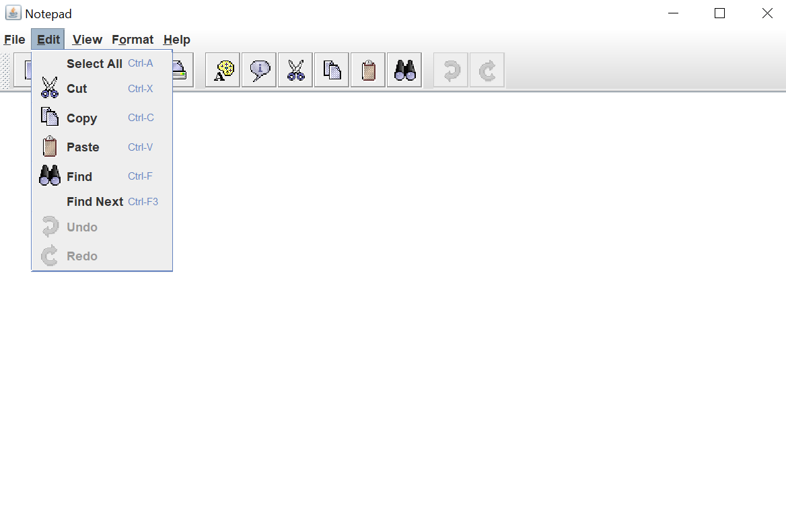
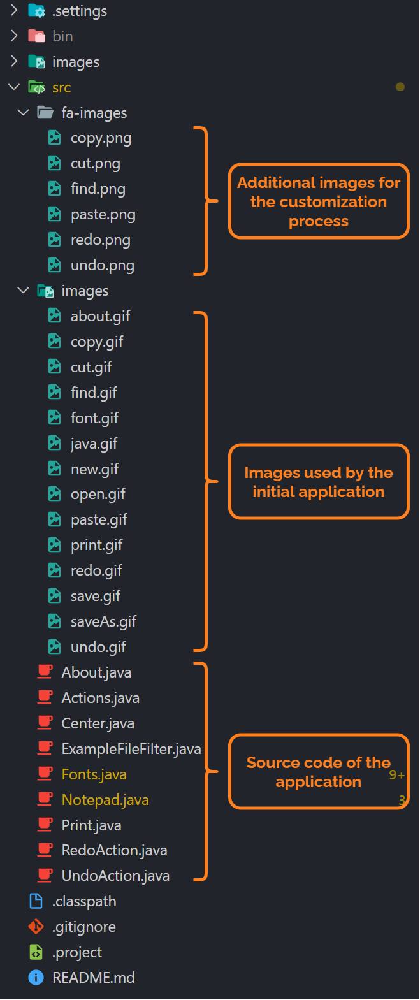
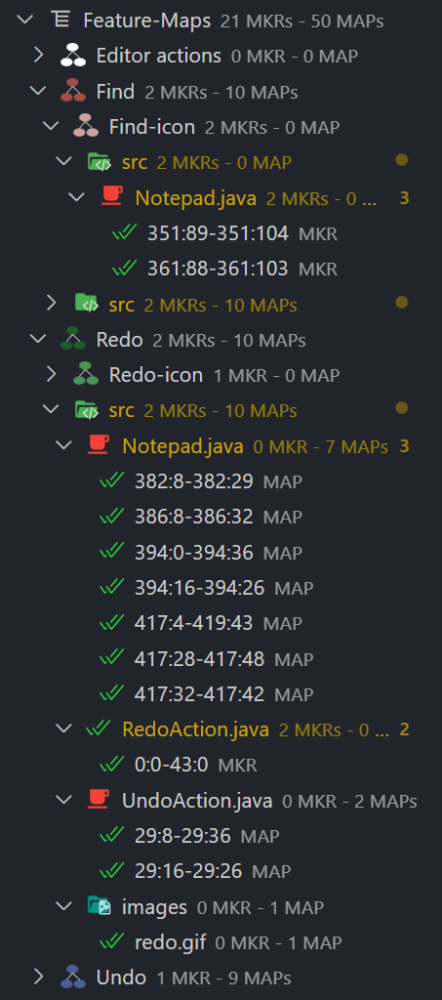

# The Notepad Application

> **The Notepad application used here is initially an example application provided by the [FeatureIDE framework](https://featureide.github.io/)**

Notepad is **a simple text editor** written in Java. It offers classical functionalities such as **_Copy_**, **_Paste_**, **_Cut_**, **_Undo_**, **_Redo_**, and **_Find_**.

## Pre-requisites

In order to easily execute the Notepad application, **we recommend installing the following extensions**:

- [Debugger for Java](https://marketplace.visualstudio.com/items?itemName=vscjava.vscode-java-debug): This extension will allow you to easily build and execute the notepad application.
- [Language Support for Java(TM) by Red Hat](https://marketplace.visualstudio.com/items?itemName=redhat.java): This will help Mobioos Forge compute the Maps of the application.

Before going into details about the SPL implementation, the following section will describe in more detail the Notepad application.

## Project overview

### Execution

By installing the [Debugger for Java](https://marketplace.visualstudio.com/items?itemName=vscjava.vscode-java-debug) extension, you can execute the Notepad application by opening the `src/Notepad.java` file and pressing the _F5_ button.

The application is made up of a text area as well as different menus and icons at the top allowing to execute the different functionalities of the application (_Cut_, _Copy_, _Paste_, _Find_, etc).

### Architecture

All the source code of the application is contained in the `src` folder. This folder also contains the images used by the application. Those images are located in two different folders:

- `images`: Folder that contains the images used by the Notepad application.
- `fa-images`: Folder that contains additional images that **can be used while customizing the application**.

The `main` method of the Notepad application is located in the `Notepad.java` file.

The screenshot below summarizes the project architecture.

## SPL Overview

### The Feature Model

In the given Feature Model, **we have 13 Features (7 Functional Features and 6 Resource Features)**. Each created Functional Feature has a sub-resource (a child in the tree) that represents the icon used by the functionality in the UI. **We also have 2 Constraints** that result from business relations between functionalities. For instance, since the Functionality Feature _Redo_ needs the _Undo_ Functional Feature to be effective, we created the Constraint: _Undo ⇒ Redo_.

### The Feature Mappings

Mapping the Features of the Notepad application has been made with 21 Markers (20 Code-Markers and 1 File-Marker). Those markers provided 50 Maps in total.
The biggest share of Markers and Maps is located inside the file `Notepad.java`. Indeed, this file contains 16 Markers and 40 Maps.

### An Example of Customization

To test the customization process, we created a customization configuration where **the features _Cut_, and _Redo_ are disabled**. In this configuration, we also gave new images from the `src-fa-images` folder as new icons for the enabled features.

If we generate a variant from this configuration, we get the following variant.

You can see on the generated variant that the features _Cut_ and _Redo_ are disabled. Also, the images provided in the configuration are used in the UI.
